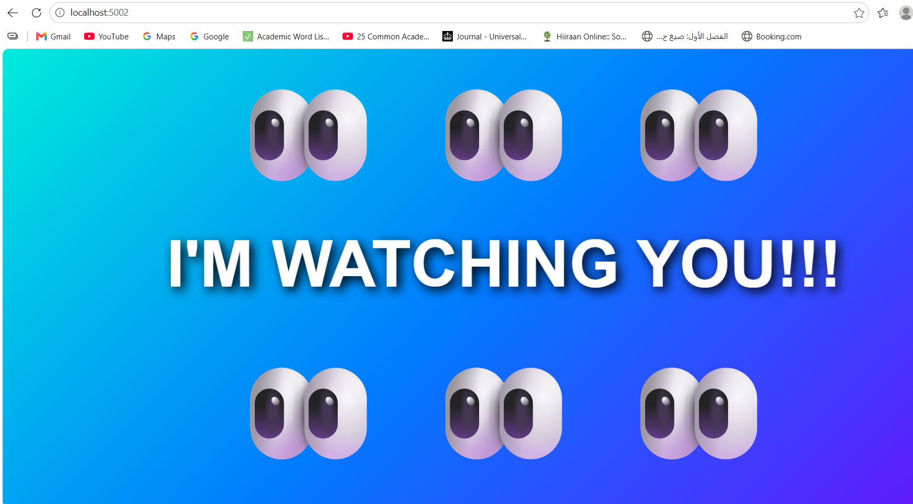
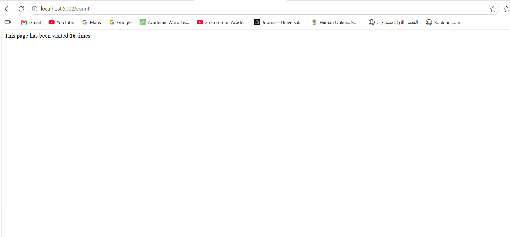
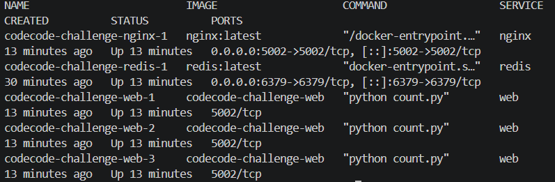
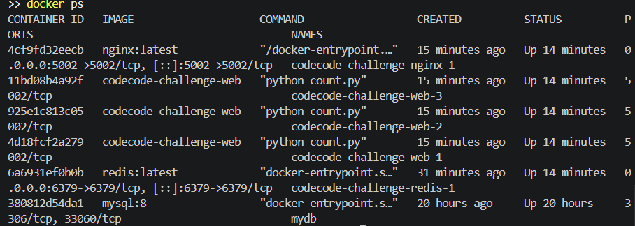
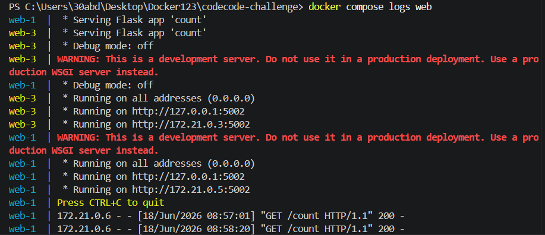

# Docker Containers Project: Flask + Redis + NGINX


This project was built as part of my Docker learning journey to gain hands-on experience building and managing multi-container applications.
Rather than running everything on one machine, the application is split into separate containers, each responsible for a single job. Docker Compose starts the whole application with one command and connects everything together automatically.

---

# What I Built

A simple web application made up of four separate services working together.

* **Flask** serves the web pages.
* **Redis** remembers how many times the page has been visited.
* **NGINX** sits at the front and shares requests across multiple Flask containers.
* **Docker Compose** starts and connects the whole application.

---

# How It Works

```text
                Browser
                   │
                   ▼
              +-----------+
              |   NGINX   |
              +-----------+
               │    │    │
         ┌─────┘    │    └─────┐
         ▼          ▼          ▼
      Flask 1    Flask 2    Flask 3
              \     |     /
               \    |    /
                ▼   ▼   ▼
                 +-------+
                 | Redis |
                 +-------+
```

When someone visits the website, the request first reaches NGINX.

NGINX forwards the request to one of the Flask containers. If the visitor opens the counter page, Flask asks Redis for the current visit count, increases it by one and displays the updated number.

---

# Features

* Multi-container application
* Docker Compose orchestration
* Redis visit counter
* Persistent Docker volume
* Environment variables
* NGINX reverse proxy
* Three Flask containers behind a load balancer

---

# Project Structure

```text
flask-redis-nginx/
│
├── screenshots/
├── count.py
├── Dockerfile
├── docker-compose.yml
├── nginx.conf
└── README.md
```

---

# Screenshots

### Homepage



### Visit Counter



### Docker Compose



### Running Containers



### Application Logs



---

# Running the Project

```bash
docker compose up --build --scale web=3
```

Open:

* `http://localhost:5002`
* `http://localhost:5002/count`

---

# What I Learned

This project gave me practical experience building and managing multi-container applications.

Along the way I learned how containers communicate over Docker networks, how volumes keep data after a container is restarted, how environment variables make applications easier to configure, and how NGINX can distribute traffic across multiple application instances.

---

# Next Steps

* Deploy to AWS
* Build a CI/CD pipeline with GitHub Actions
* Explore Kubernetes for container orchestration
* Add monitoring and logging
