# AWS Assignment 1 - VPC Networking

> Building a secure AWS network using a custom VPC, public and private subnets, a Bastion Host, NAT Gateway, Apache and CloudWatch.

## Overview

This project was my first time building a complete AWS network from scratch.

Instead of simply launching an EC2 instance, I wanted to understand how AWS networking works in a real environment. By the end of the project, I had built a secure network with public and private subnets, used a Bastion Host to securely access a private EC2 instance, installed Apache and set up CloudWatch monitoring.

## Architecture

The diagram below shows the environment I built.

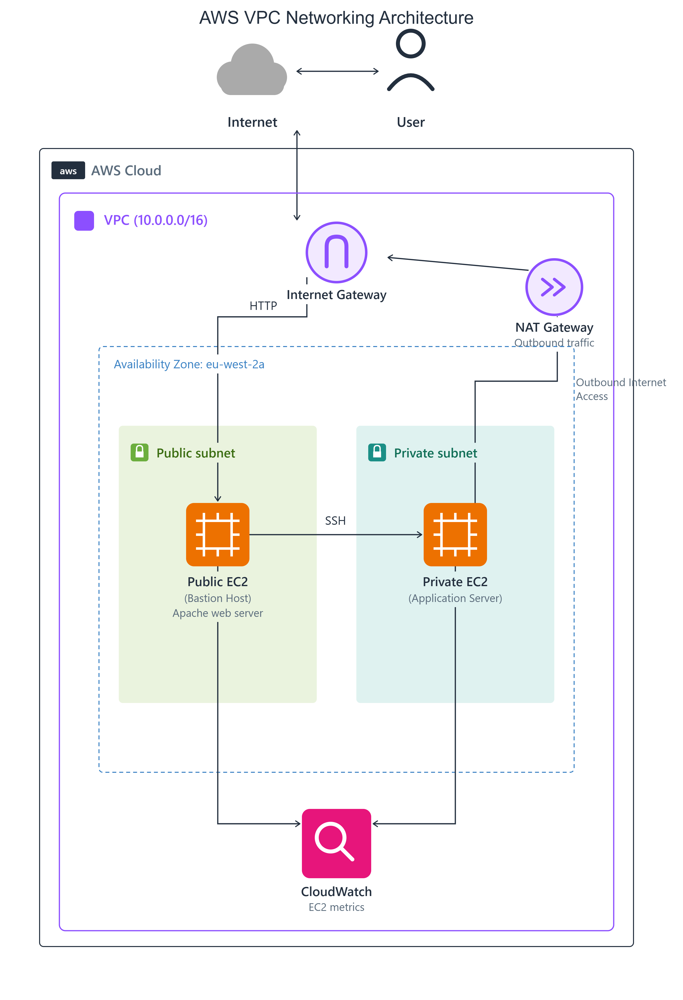

## What I Built

- Custom VPC
- Public subnet
- Private subnet
- Internet Gateway
- NAT Gateway
- Public EC2 (Bastion Host)
- Private EC2
- Apache Web Server
- Route Tables
- Security Groups
- CloudWatch monitoring

## AWS Services Used

| Service | Purpose |
|---------|---------|
| Amazon VPC | Created an isolated network |
| Amazon EC2 | Hosted the virtual machines |
| Internet Gateway | Connected the public subnet to the internet |
| NAT Gateway | Allowed the private subnet to access the internet safely |
| Route Tables | Controlled where network traffic travelled |
| Security Groups | Controlled access to the EC2 instances |
| IAM | Allowed CloudWatch to collect metrics |
| CloudWatch | Monitored both EC2 instances |

## Project Walkthrough

### Create the VPC

Everything started with creating a custom VPC. This gave me my own isolated network instead of using AWS's default one.

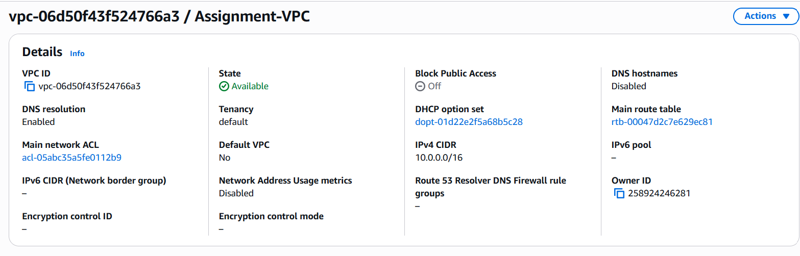

### Create the Subnets

Next, I created one public subnet and one private subnet.

The public subnet is where internet-facing resources live, while the private subnet keeps internal resources hidden from direct internet access.

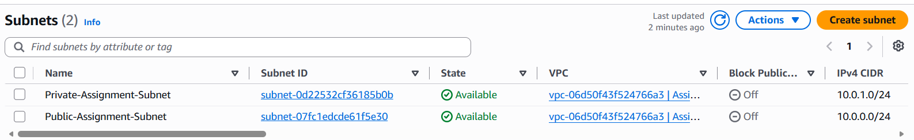

### Internet Gateway

I attached an Internet Gateway so the public subnet could communicate with the internet.

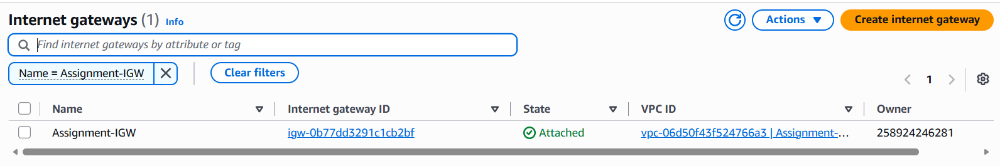

### Route Tables

I created separate route tables for both subnets.

The public route table sends internet traffic to the Internet Gateway, while the private route table sends outbound traffic through the NAT Gateway.

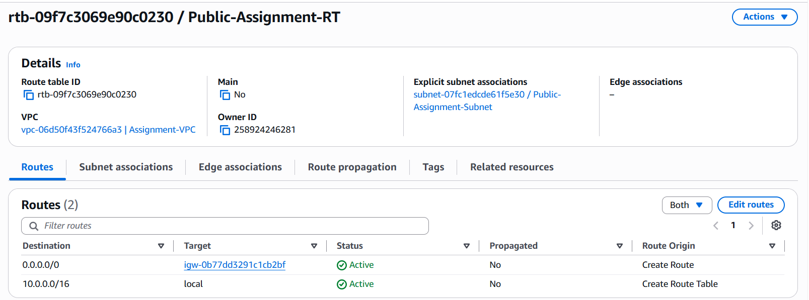

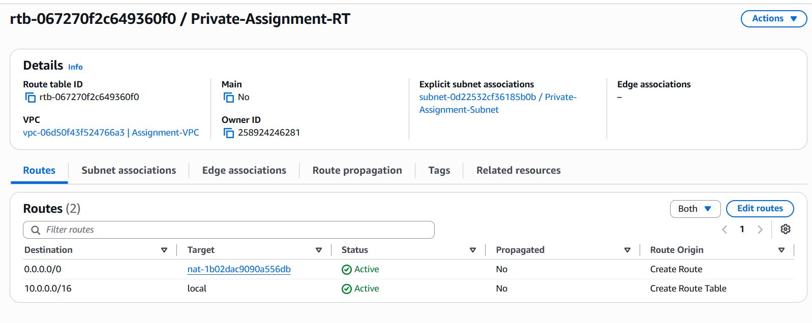

### NAT Gateway

The NAT Gateway allows the private EC2 instance to download updates and install packages without making it publicly accessible.

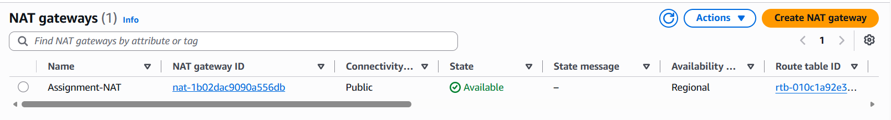

### Launch the EC2 Instances

I launched two EC2 instances.

One sits in the public subnet and acts as the Bastion Host.

The other sits in the private subnet and can only be reached through the Bastion Host.

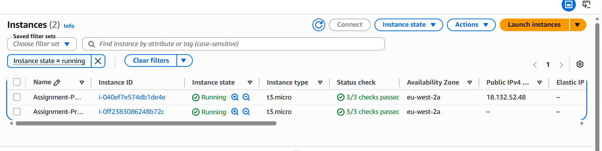

### Security Groups

I configured Security Groups to control access.

The public EC2 allows SSH and HTTP traffic.

The private EC2 only accepts SSH connections from the Bastion Host.

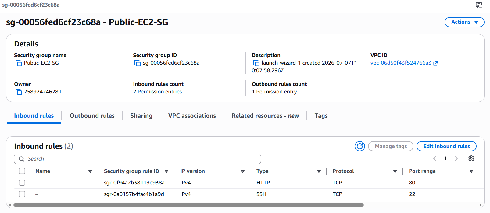

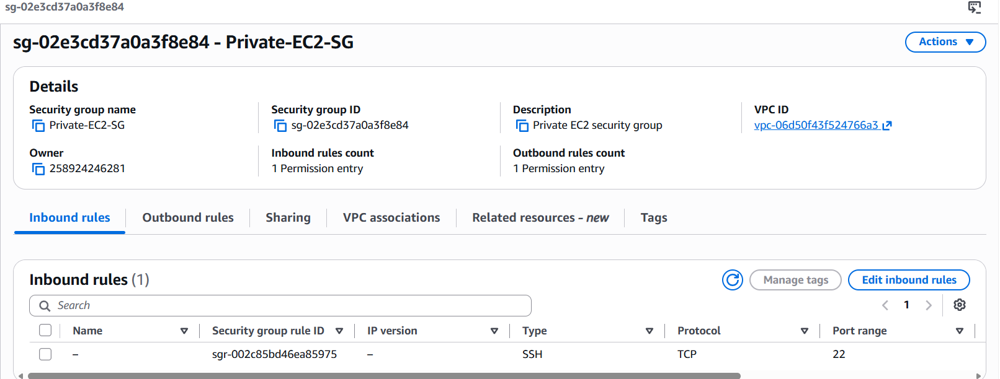

### Bastion Host

Once everything was configured, I used the public EC2 instance to securely SSH into the private EC2.

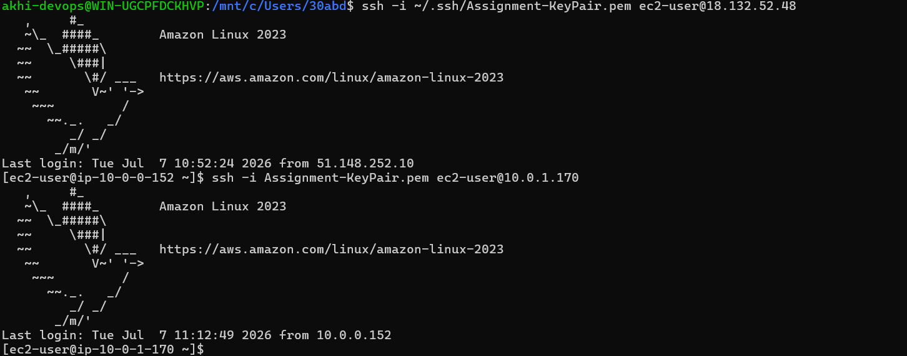

### Apache

I installed Apache and confirmed the web server was running correctly.

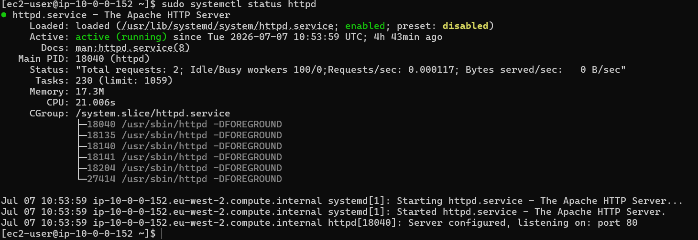

### CloudWatch

Finally, I attached an IAM role, installed the CloudWatch Agent and confirmed that both EC2 instances were sending metrics.

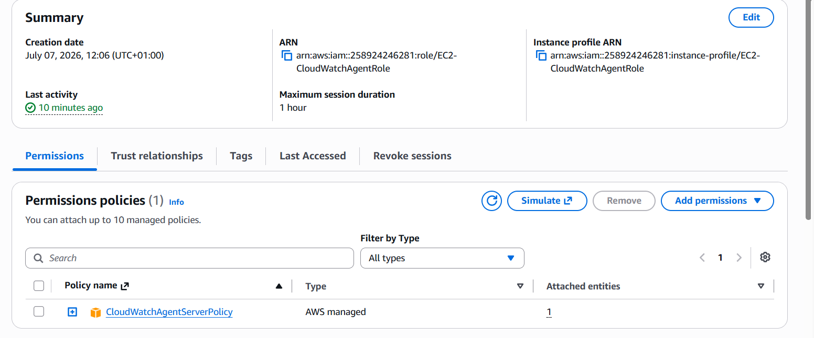

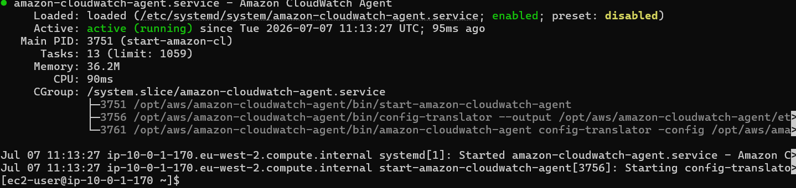

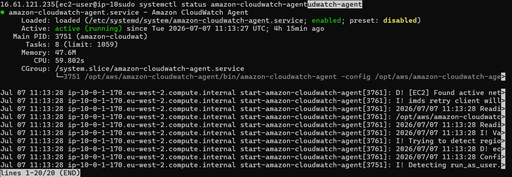

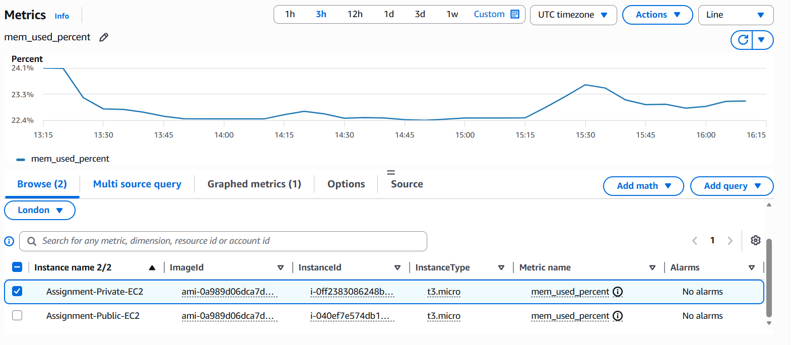

## Challenges

One issue I ran into was connecting to the private EC2 instance. After checking the configuration, I realised the SSH access wasn't set up correctly. Once the Bastion Host and Security Groups were configured properly, the connection worked.

Another issue was the private EC2 not having internet access. This turned out to be a routing problem. Updating the private route table to use the NAT Gateway fixed it.

I also found that simply installing the CloudWatch Agent wasn't enough. The EC2 instance needed the correct IAM role before metrics started appearing in CloudWatch.

## Commands Used

Connect to the Bastion Host

```bash
ssh -i key.pem ec2-user@<public-ip>
```

Update packages

```bash
sudo yum update -y
```

Install Apache

```bash
sudo yum install httpd -y
```

Start Apache

```bash
sudo systemctl start httpd
sudo systemctl enable httpd
```

Install CloudWatch Agent

```bash
sudo yum install amazon-cloudwatch-agent -y
```

## What I Learned

This project helped me understand how AWS networking works beyond the theory.

I learned how public and private subnets work together, why Bastion Hosts improve security, how NAT Gateways provide safe internet access for private resources and how CloudWatch helps monitor EC2 instances.

Most importantly, I learned that when something doesn't work in AWS, the answer is usually hidden in the networking, routing or permissions.