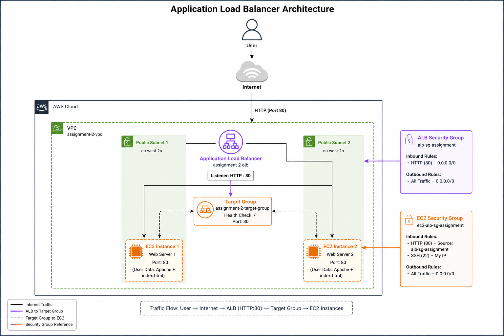
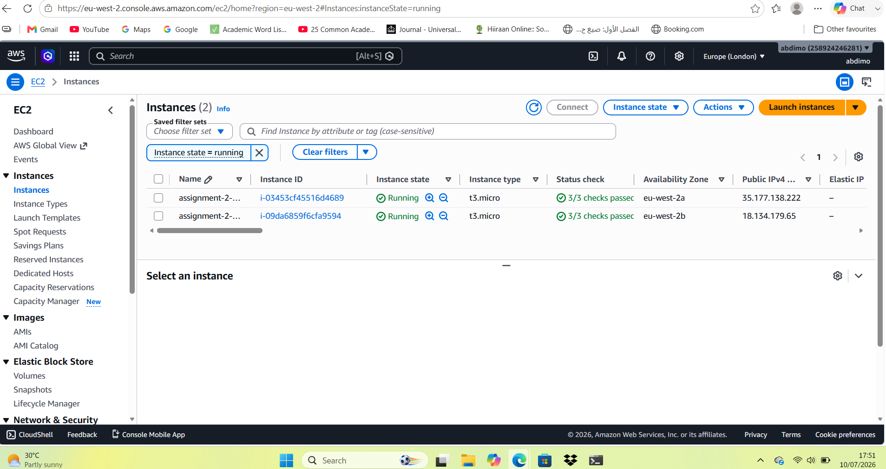
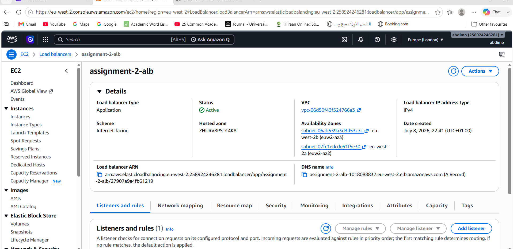
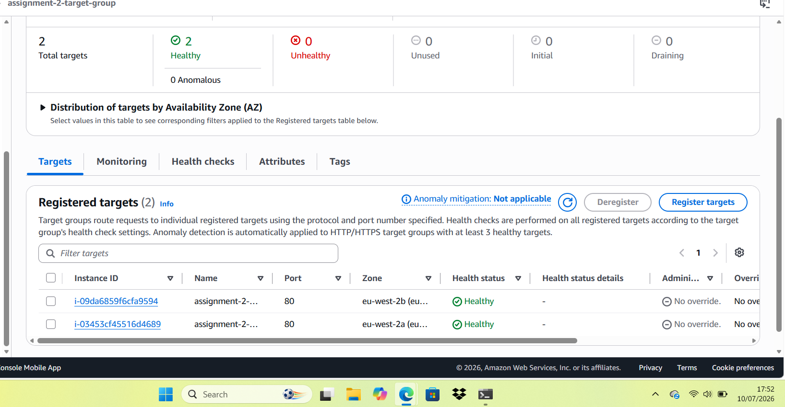
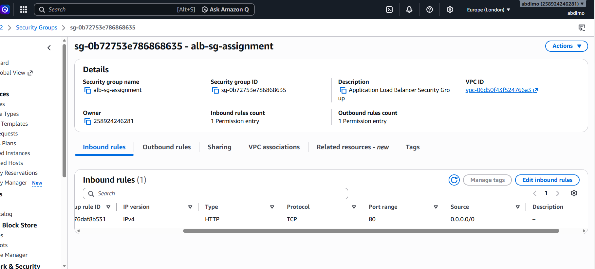
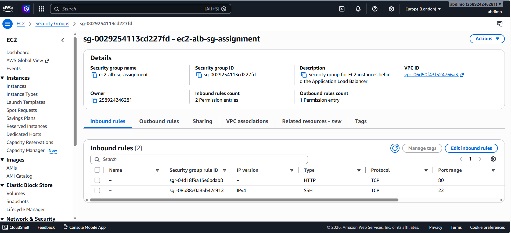
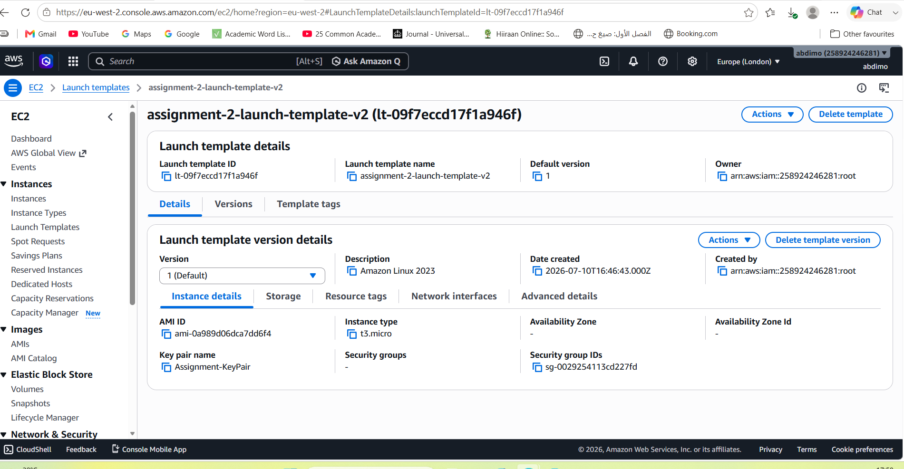
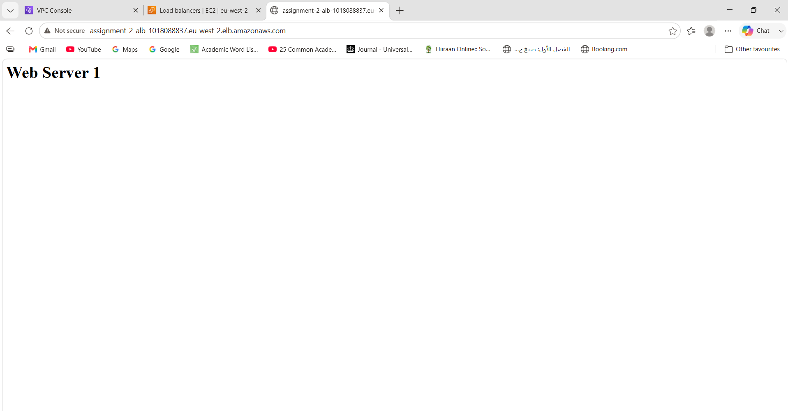
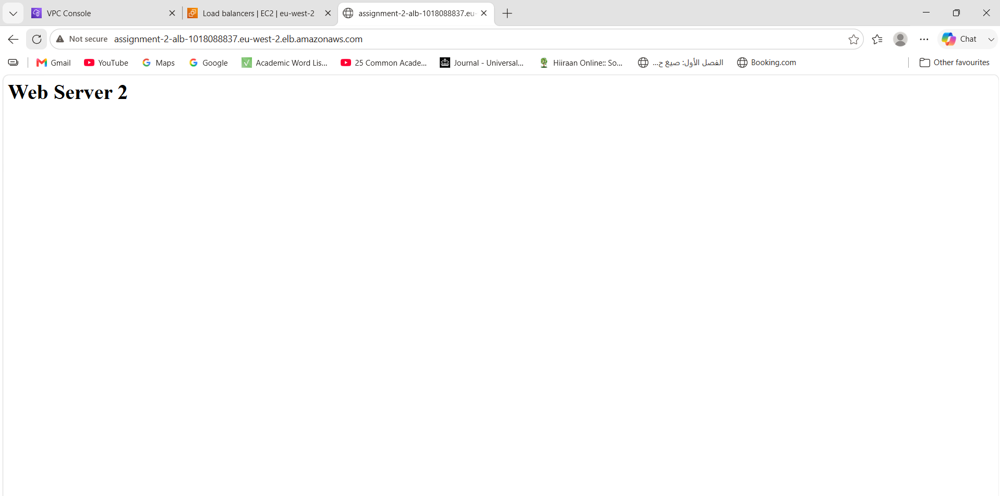

# Application Load Balancer

## Project Overview

In this project I deployed an Application Load Balancer (ALB) in front of two EC2 instances.

Each EC2 instance runs a simple Apache web server with different content so it was easy to see the load balancer distributing traffic between them.

The EC2 instances are only accessible through the ALB, following a more secure and realistic architecture.

---

## Architecture



---

## AWS Services Used

- Amazon EC2
- Application Load Balancer (ALB)
- Target Groups
- Security Groups
- Amazon VPC
- Launch Template

---

## Resources Created

- 1 VPC
- 2 Public Subnets
- 2 EC2 Instances
- 1 Application Load Balancer
- 1 Target Group
- 2 Security Groups
- 1 Launch Template

---

## Deployment

### Step 1 - Launch EC2 Instances

I launched two EC2 instances in separate Availability Zones.

Using user data, Apache was installed automatically when each instance started.

Each server displayed different content so I could easily test that the load balancer was working.

**Commands used**

```bash
sudo dnf update -y
sudo dnf install httpd -y
sudo systemctl enable httpd
sudo systemctl start httpd
```

Server 1

```bash
echo "<h1>Web Server 1</h1>" | sudo tee /var/www/html/index.html
```

Server 2

```bash
echo "<h1>Web Server 2</h1>" | sudo tee /var/www/html/index.html
```

Check Apache

```bash
sudo systemctl status httpd
```

Test locally

```bash
curl localhost
```



---

### Step 2 - Create the Application Load Balancer

I created an internet-facing Application Load Balancer across two public subnets.

An HTTP listener on port 80 forwards traffic to the target group.



---

### Step 3 - Configure the Target Group

Both EC2 instances were registered with the target group.

The health check was configured to use:

```text
/
```

Once Apache finished installing, both instances passed the health checks.



---

### Step 4 - Configure Security Groups

The ALB Security Group allows HTTP traffic from anywhere.



The EC2 Security Group only allows HTTP traffic from the ALB Security Group.

This means the web servers cannot be accessed directly from the internet.



---

### Step 5 - Launch Template (Bonus)

As an additional task, I created a Launch Template using Amazon Linux 2023.

The template includes:

- Amazon Linux 2023 AMI
- t3.micro instance type
- Key Pair
- EC2 Security Group

This can be reused when creating an Auto Scaling Group.



---

## Testing

I opened the Application Load Balancer DNS name in a browser.

Refreshing the page returned responses from both EC2 instances, confirming that traffic was being distributed correctly.

### Web Server 1



### Web Server 2



---

## Challenges

### ALB and EC2 were in different VPCs

At first I realised my Application Load Balancer and EC2 instances had been created in different VPCs.

I recreated the resources inside the same VPC so the target group could register the instances correctly.

### No registered targets

I had deleted my EC2 instances earlier to reduce AWS costs.

After launching two new instances, I registered them with the target group and confirmed they became healthy.

### Health checks

The health checks stayed in the **Initial** state for a short time.

After waiting for the user data script to finish installing Apache, both instances became healthy automatically.

### Launch Template

My first launch template was missing the AMI, so it couldn't be used.

I created a new launch template with the correct Amazon Linux 2023 AMI and it worked as expected.

---

## Key Learnings

- Built an Application Load Balancer from scratch
- Connected multiple EC2 instances to a Target Group
- Used health checks to monitor application availability
- Configured Security Groups to improve security
- Deployed resources across multiple Availability Zones
- Created a reusable Launch Template
- Gained a better understanding of how ALBs, Target Groups and EC2 instances work together

---

## Cleanup

After testing was complete, I terminated the EC2 instances to avoid unnecessary AWS charges while keeping the project documentation and screenshots.